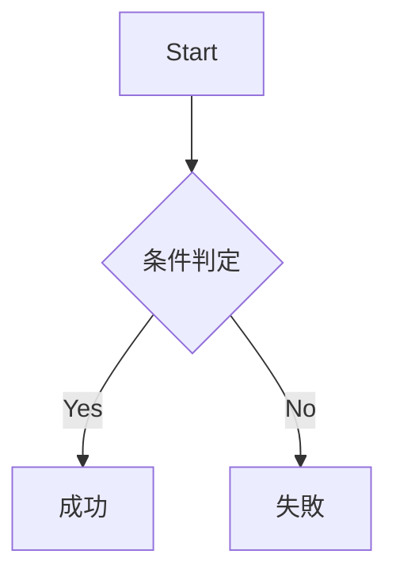
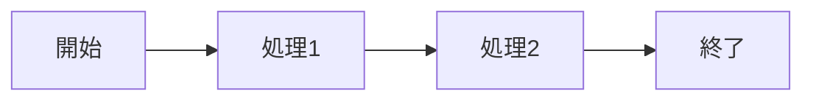
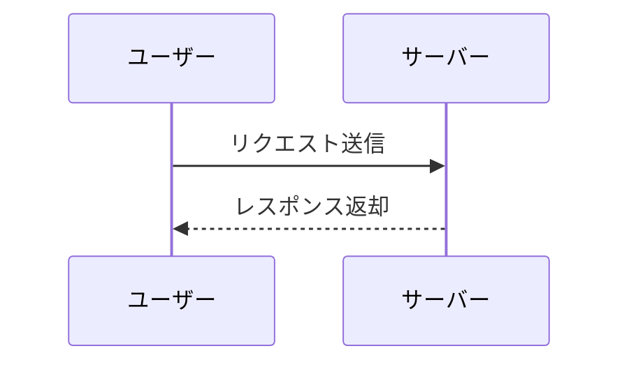
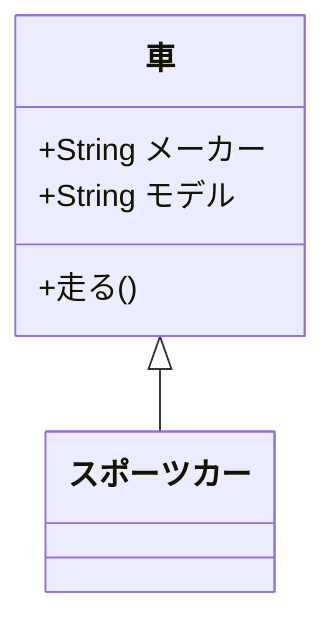
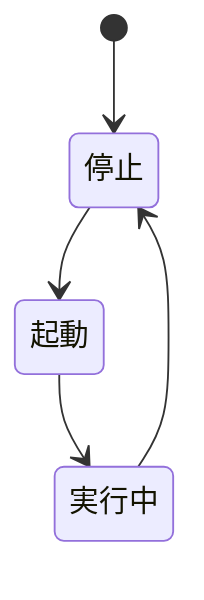
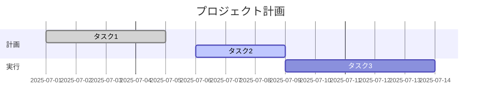
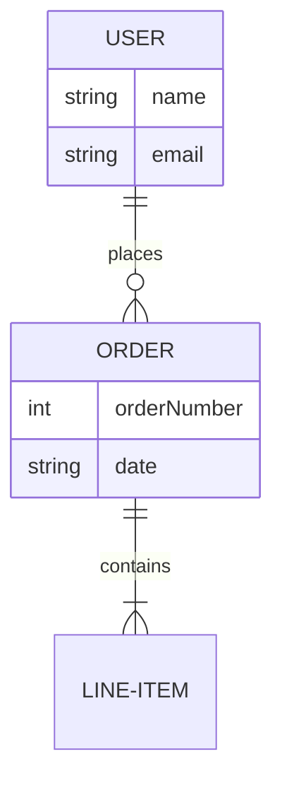

# サンプルMarkdown (Mermaidモリモリ版)

このファイルは、Markdownの基本記法とMermaidの各種図をテストするためのサンプルです。

## 見出しとテキスト
- リスト例 1
- リスト例 2
- **強調**、*斜体*、~~取り消し線~~

## コードブロック
```csharp
for (int i = 0; i < 3; i++) {
    Console.WriteLine($"Count: {i}");
}
```

---

## Mermaid サンプル集

### フローチャート (基本)


### フローチャート (LR方向)


### シーケンス図


### クラス図


### 状態遷移図


### ガントチャート


### ER図

